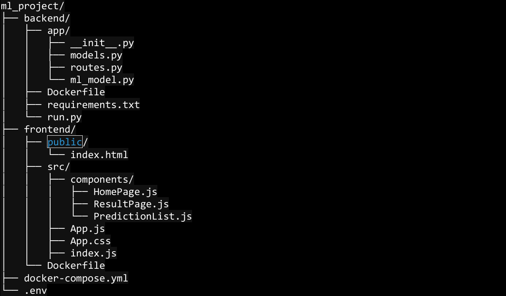

# Orchestration d'une  application sur Kubernates

L'objectif de ce project est de créer un modèle machine leaning qui fait la prediction des dates des dèces des 
utilisateurs, ce modele est deployé dans une application Web qui permet aux utilisateurs d'entrer leur prénom, nom et âge pour obtenir 
une prédiction humoristique de leur date de décès. 
Toutes les decès sont stockés sur une base des données MySql pour ister toutes les prédictions faites.

Structure de l'Application 

L'application est divisée en trois parties principales : 
1. **Backend (Flask)** : Gère les requêtes API, interagit avec la base de données MySQL et 
génère les prédictions. 
2. **Frontend (React)** : Fournit une interface utilisateur permettant d'entrer des données, 
de voir les résultats de prédictions et de gérer la liste des prédictions. 
3. **Docker** : Utilisé pour conteneuriser l'application, ce qui facilite le déploiement et la 
gestion des dépendances.

L'objectif est de deloyer ce project sur un cluster kubernates, le dockerfile est fournit faire le build et stocker les images sur registry dockerhub

- Création de **namespace** pour permettre l'isolation des ressources les uns aux autres et limitation d'accès
- Nous avons créer 3 déploiements dont pour la base de données MYSQ, un autre pour l’application backend et 
un autre deploiement pour l'application frontend.
- Un service de type **ClusterIP** pour la base de données MYSQL, un autre de type ClusterIP pour l’application backend 
qui expose le port **5000** (Ce service est utilisé par l’application frontend pour appeler les API) et un autre 
service de type **NodePort** qui target le port **3000** et expose le port 30001 et 
qui servira à accéder sur l’application depuis le navigateur)

- Nous avons créer un **PVC (Persistant Volume Claim )** de 2Gi pour stocker les données de la base de données 
- Nous avons créée trois configMaps : pour faciliter la modification et suppression de nos variables d'envirironment
  a. Un **configMap** pour la base de données MySQL qui stock (le nom de la base de données MYSQL_DATABASE) 
  b. Un configMap pour l’application backend qui stock (le nom de la base de données 
  MYSQL_DATABASE et la variable d’environnement FLASK_ENV que vous trouverez dans le docker-compose) 
  c. Un configMap pour l’application frontend qui stock (l’url du backend, ici vous  devez veillez à utiliser le nom du service 
  du backend avec le port 5000 exposé  et la variable d’environnement CHOKIDAR_USEPOLLING) 
  
  